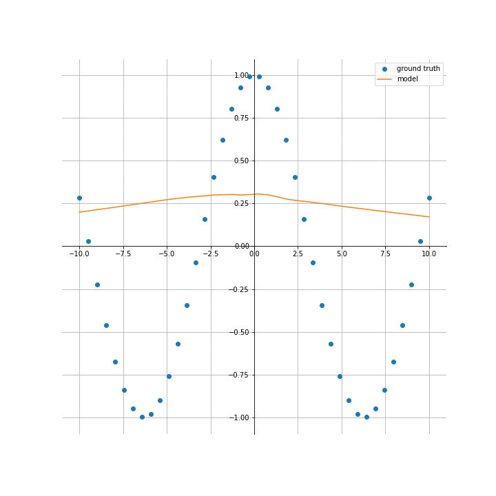

**ASSIGNMENT 1**

In this assignment you will practice working with the Google Colab environment and PyTorch. You’ll also practice building a model to fit a function. The goals of this practice are the following:

-   Gain experience setting and using notebooks on Google Colab.
-   Develop familiarity with basic structures of PyTorch: tensors, autograd, modules.
-   Understand neural networks as functions and models for functions approximation.
-   Develop familiarity with the data-driven approach.
-   Train a neural network to fit 1D functions.
-   Use visualization tools to evaluate your result.

------
### Instructions:
If you’re using Google Colab, you just need to have a google account and an associated Google Drive. In case you’re choosing to work locally in your machine you must set Anaconda or a venv virtual environment, and install the necessary libraries.

Create a folder in your Google Drive or in your machine’s workspace. Copy to your drive folder or download the following notebook:

[Assignment 1 Notebook](https://colab.research.google.com/github/hallpaz/3dsystems23/blob/main/assignments/lab1_fittingfunctions.ipynb)

Follow the instructions in the notebook for completing the assignment.

You can build auxiliary .py scripts and call them from your notebook, for organizational purposes.

### Submission for IMPA students
The assignment is due on April 3rd, 2023 at 11:59pm (GMT-3).

IMPA students that are regularly enrolled in the program should send their assignments before the due date to [hallpaz@impa.br](mailto:hallpaz@impa.br) with a copy to [lvelho@impa.br](mailto:lvelho@impa.br). Late delivers will be consider subject to a lower score.

The submission email should be sent with the subject “Assignment 1 - [first-name] - [last-name]”. The assignment can be structured and sent in two ways:

If your whole solution is implemented in the same notebook as the one provided for the assignment, then you can send just the .ipynb file as the solution.
If parts of your implementation were done in auxiliary .py scripts, then you must send both the final notebook and the scripts inside a .zip file.
The organization of the code will also be considered in the evaluation.

### For remaining students:
For students that are enrolled as “Aluno de Curso Livre” you must not send your assignment to us, since we’ll not be able to evaluate them due to the large number of students and lack of resources from our side.

For students following the course on this modality, we recall that all assignments will be corrected/solved during the Lab classes. Therefore, students must evaluate themselves by comparing our corrections with their solutions. 

### References:

1. Daniel Yukimura. [An Introduction to PyTorch (Slides)](https://slides.com/danielyukimura/deck-493038)
2. Programação Dinâmica. [Como usar o Google Colab para Analisar Dados? (Vídeo)](https://youtu.be/_mIwsA2ddSc)
3. PyTorch Tutorial: [Training a Classifier](https://pytorch.org/tutorials/beginner/blitz/cifar10_tutorial.html)