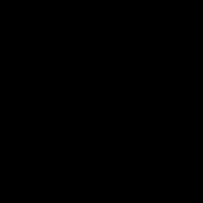

**ASSIGNMENT 2 - LEARNING SIGNALS**

In this assignment you will see in practice the theory of sampling and reconstruction of signals, and you will learn signals with neural networks. The goals of this practice are the following:

- Perform uniform sampling, and reconstruction using the Shanon basis.
- Verify conditions where there is Aliasing.
- Relate spatial and spectral representations of a signal.
- Verify the spectral bias of MLP toward lower frequencies.
- Fit an image signal using neural networks.

[Assignment 2 Notebook](https://colab.research.google.com/github/hallpaz/3dsystems23/blob/main/assignments/lab2_learningsignals.ipynb)

------
### Instructions:
If you’re using Google Colab, you just need to have a google account and an associated Google Drive. In case you’re choosing to work locally in your machine you must set Anaconda or a venv virtual environment, and install the necessary libraries.

Create a folder in your Google Drive or in your machine’s workspace. Copy to your drive folder or download the notebook above.

Follow the instructions in the notebook for completing the assignment.

You can build auxiliary .py scripts and call them from your notebook, for organizational purposes.

### Submission 

The assignment is due on April 10th, 2023 at 11:59pm (GMT-3).

Students should send their assignments before the due date to hallpaz@impa.br with a copy to lvelho@impa.br. Late delivers will be consider subject to a lower score.

The submission email should be sent with the subject “Assignment 2 - [first-name] - [last-name]”. The assignment can be structured and sent in two ways:

If your whole solution is implemented in the same notebook as the one provided for the assignment, then you can send just the .ipynb file as the solution. If parts of your implementation were done in auxiliary .py scripts, then you must send both the final notebook and the scripts inside a .zip file. The organization of the code will also be considered in the evaluation.

### References:

1. Learning Signals - [class video](https://www.youtube.com/watch?v=OcxvX4bMnzk).
2. [Amostragem e Reconstrução de Imagens](https://www.youtube.com/live/E8PJDhwy_RI?feature=share) - O que é ALIASING e Como Redimensionar Imagens em Python
2. Vincent Sitzmann, Julien N. P. Martel, Alexander W. Bergman, David B. Lindell, Gordon Wetzstein. Implicit Neural Representations with Periodic Activation Functions. In Proc. NeurIPS, 2020.
3. Hallison Paz, Tiago Novello, Vinicius Silva, Guilherme Shardong, Luiz Schirmer, Fabio Chagas, Helio Lopes, Luiz Velho. Multiresolution Neural Networks for Imaging. Sibgrapi, 2022.
4. [Interpolation in 5 Minutes](Interpolation in 5 minutes).
5. [Images in 5 minutes](https://youtu.be/xUzhKqf22mY): The Case of the Splotched Van Gogh, Part 1.
6. [Image filtering in 5 minutes](https://youtu.be/6v8dNtknOSM): The Case of the Splotched Van Gogh, Part 2
7. [Fourier Transform in 5 minutes](https://youtu.be/JciZYrh36LY): The Case of the Splotched Van Gogh, Part 3