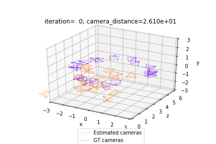

**ASSIGNMENT 4: BUNDLE ADJUSTMENT**

In this assignment, we will learn to simultaneously compute the extrinsic parameters of a set (bundle) of cameras, given multiple pairs of relative transformations between them. It's an instance of the bundle adjustment problem, which is very important for stereoscopy and 3D reconstruction. We'll use PyTorch3D API to set up an optimization process and minimize the discrepancies between pairs of relative cameras. 

**The goals of this practice are the following:**

-   Get more familiarization with camera representations
-   Discover new APIs in PyTorch3D to work with rigid transforms
-   Use the power of neural networks and gradient descent to solve a classic optimiation

## Instructions:
If you’re using Google Colab, you just need to have a google account and an associated Google Drive. Make a copy of the notebook located below and modify it as requested.

In case you’re choosing to work locally in your machine you must set Anaconda or a `venv` virtual environment, and install the necessary libraries. Create a folder in your Google Drive or in your machine’s workspace. Copy to your drive folder or download the following notebook:

[Assignment  Notebook](https://colab.research.google.com/github/hallpaz/3dsystems23/blob/main/assignments/lab4_bundleadjustment.ipynb)

1. Follow the instructions in the notebook for completing the assignment.
2. If you want, you can build auxiliary .py scripts and call them from your notebook, for organizational purposes.

### Instructions:

If you’re using Google Colab, you just need to have a google account and an associated Google Drive. In case you’re choosing to work locally in your machine you must set Anaconda or a venv virtual environment, and install the necessary libraries.

Create a folder in your Google Drive or in your machine’s workspace. Copy to your drive folder or download the notebook above.

Follow the instructions in the notebook for completing the assignment.

You can build auxiliary .py scripts and call them from your notebook, for organizational purposes.

### Submission 

The assignment is due on April 26th, 2023 at 11:59pm (GMT-3).

Students should send their assignments before the due date to hallpaz@impa.br with a copy to lvelho@impa.br. Late delivers will be consider subject to a lower score.

The submission email should be sent with the subject “Assignment 4 - [first-name] - [last-name]”. The assignment can be structured and sent in two ways:

If your whole solution is implemented in the same notebook as the one provided for the assignment, then you can send just the .ipynb file as the solution. If parts of your implementation were done in auxiliary .py scripts, then you must send both the final notebook and the scripts inside a .zip file. The organization of the code will also be considered in the evaluation.

### References:

1. Jonas Gomes, Luiz Velho and Mario Costa Sousa. Computer Graphics: Theory and Practice, chapters 2, 3 and 4.
2. Richard Hartley and Andrew Zisserman. Multiple View Geometry in Computer Vision, chapter 18.
3. PyTorch3D Tutorials - [Bundle Adjustment](https://pytorch3d.org/tutorials/bundle_adjustment)