## Differentiable Rendering

## 3D Graphics Systems | AI Graphics - Theory and Practice

### Hallison Paz
###### IMPA, June 7th, 2023

<!-- _class: invert -->
<!-- _paginate: false -->

---

# Why Differentiable Rendering?

- Relate 2D pixels to 3D properties
- Image based 3D reasoning

<!-- # image abacaxi-->

---

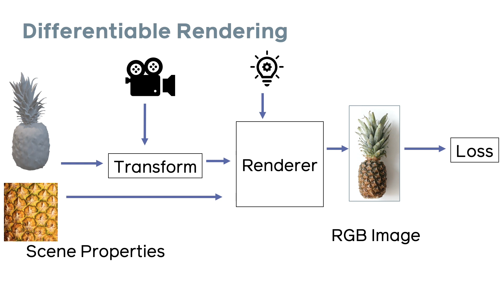

----

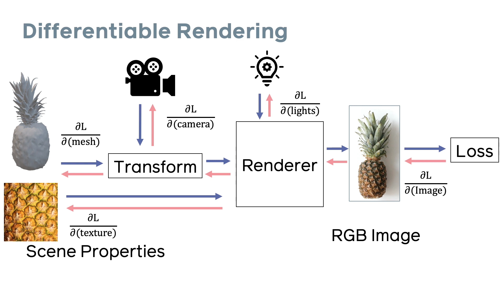

---

# Bridging the Gap: Graphics <> Vision

### Scene parameters: $\theta$

$$ f(\theta) = I$$

$$ E(\theta) = ||f(\theta) - I||^2$$

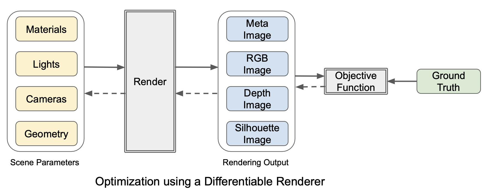

<!-- M.M. loper and M. J. Black. OpenDR: An approximate differentiable renderer. Springer, 2014. -->

----
# Self supervised learning

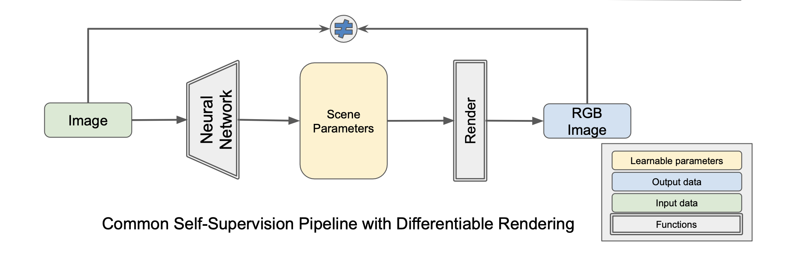

----

# Challenges

<!-- _class: topic -->
<!-- _paginate: false -->
---

# Rasterization Pipeline

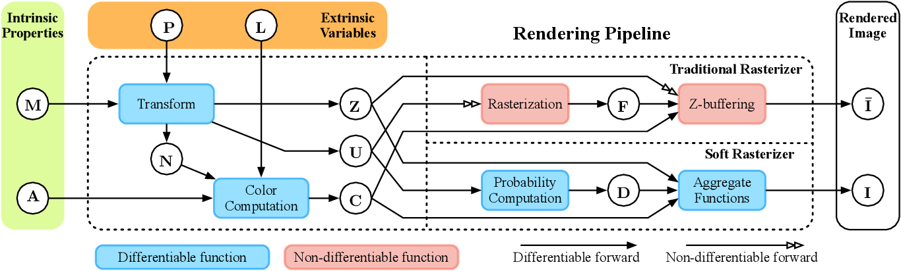

<!-- _footer: Soft Rasterizer -->

---

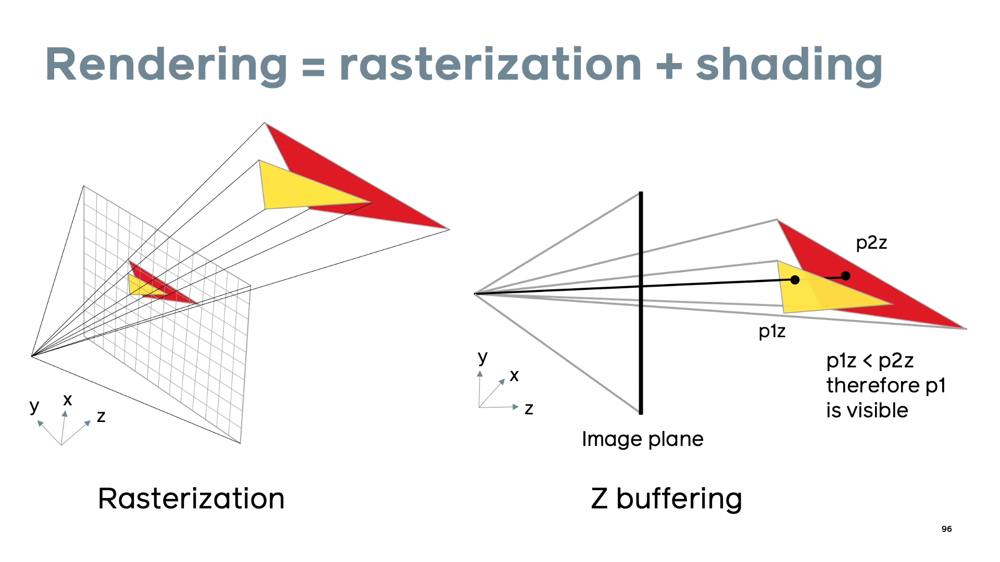

<!-- _footer: PyTorch3D Siggraph Asia 2020 course -->
---

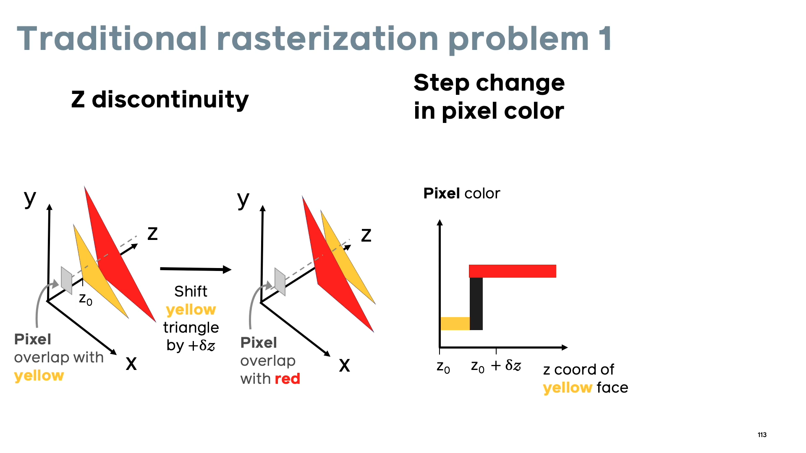

---

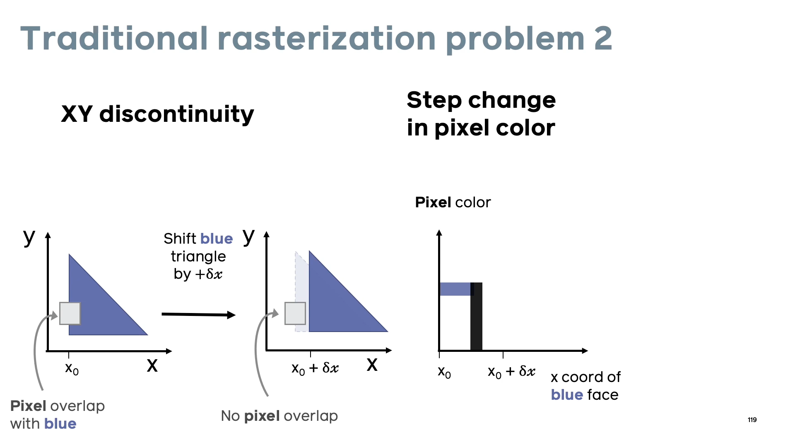

---

# Commom approaches

### Approximated gradients
* Open DR
* Neural 3D Mesh renderer
### Approximated rendering
* Soft Rasterizer

<!-- _footer: for a more complete list, see: Kato, Hiroharu & Beker, Deniz & Morariu, Mihai & Ando, Takahiro & Matsuoka, Toru & Kehl, Wadim & Gaidon, Adrien. (2020). Differentiable Rendering: A Survey.  -->

---

# Open DR

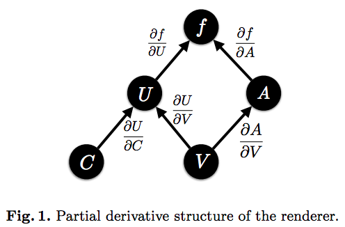

---

# Open DR

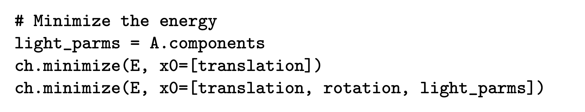
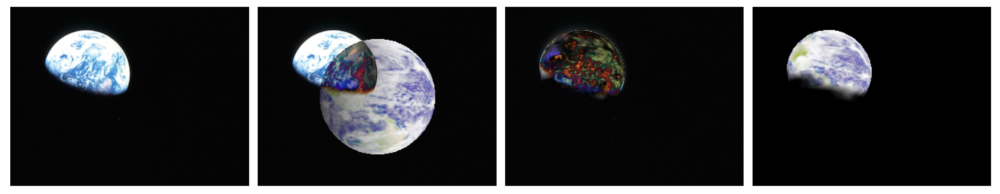

<!-- _footer: OpenDR - [paper](https://files.is.tue.mpg.de/black/papers/OpenDR.pdf) -->

---

# Neural 3D Mesh Renderer

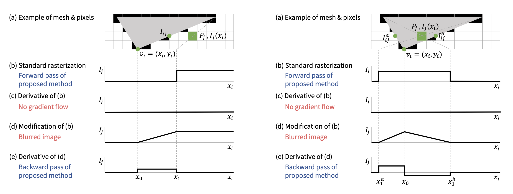

<!--  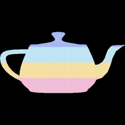 -->

<!-- _footer: Neural 3D Mesh Renderer [repository](https://github.com/hiroharu-kato/neural_renderer) -->

---

# Soft Rasterizer 

## Approximated rendering

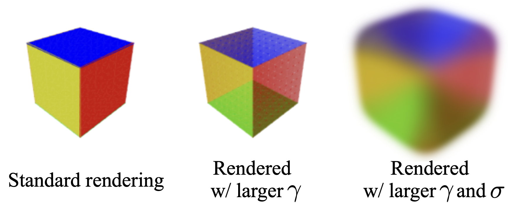

---

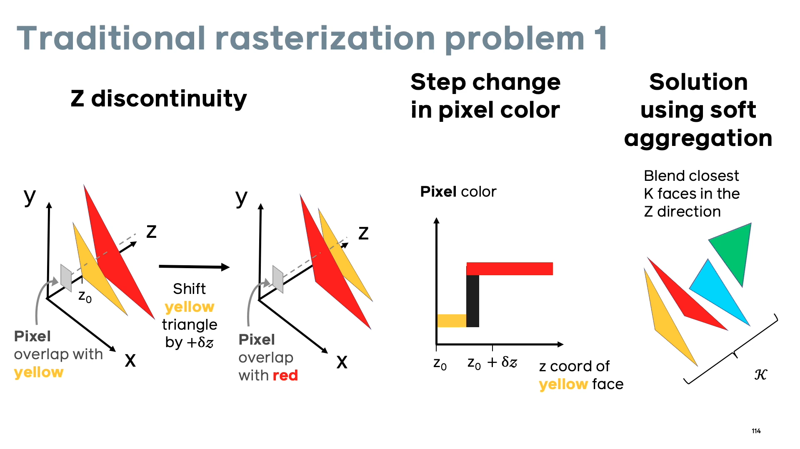

---

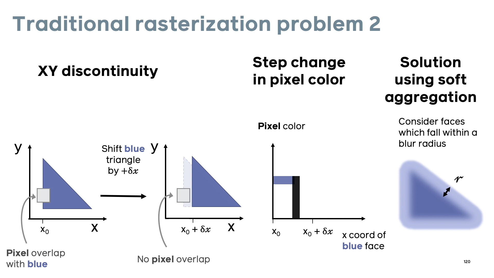

---

# Fuzzy geometry

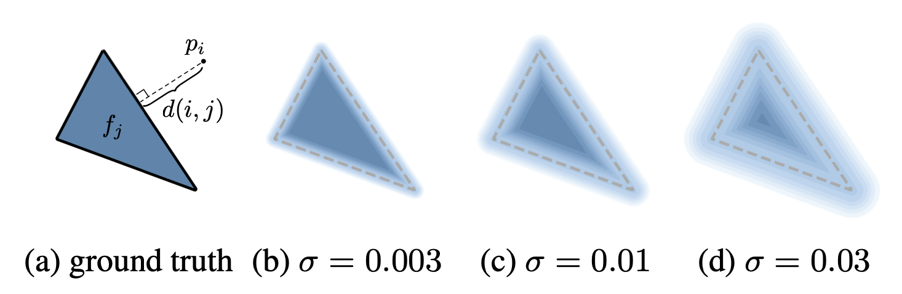

Probability map $D_j$ at pixel $p_i$:
$$D^{i}_{j} = sigmoid(\delta^i_j * \frac{d^2(i, j)}{\sigma})$$

$$\delta^i_j = \{+1, \text{if $p_i$} \in f_j ; −1, \text{otherwise}\}$$

---

# Aggregation

$$I^i = A_S(\{C_j\}) = \sum_j{w^i_jC^i_j + w^i_bC_b}$$

$$w^i_j = \frac{D^i_jexp(z^i_j/\gamma)}{\sum_k{D^i_kexp(z^i_k/\gamma) + exp(\epsilon/\gamma)}}$$

- $z^i_j$ - normalized inverse depth 
- $\epsilon$  (for background) 
- $\gamma$ - sharpness of the aggregate function.

----

# PyTorch3D

<!-- _class: topic -->
<!-- _paginate: false -->

